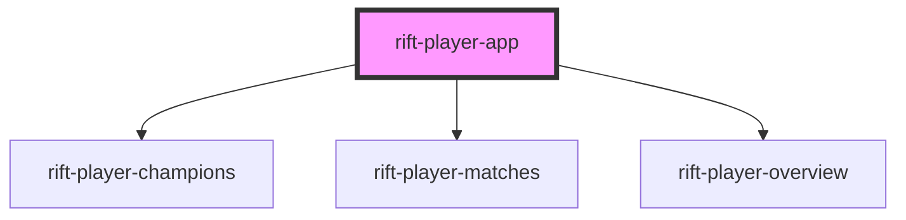

# rift-player-app

<!-- Auto Generated Below -->

## Overview

Top-level player MFE shell. Hand-rolled sub-router (no

## Properties

| Property         | Attribute       | Description                                                                  | Type                                                                                  | Default      |
| ---------------- | --------------- | ---------------------------------------------------------------------------- | ------------------------------------------------------------------------------------- | ------------ |
| `initialRoute`   | `initial-route` | Initial sub-route, used by the host to deep-link e.g. /player/match-history. | `"champions" \| "matches" \| "overview"`                                              | `"overview"` |
| `matchHistory`   | --              | Match history, forwarded to `<rift-player-matches>`.                         | `MatchEntry[]`                                                                        | `undefined`  |
| `ownedChampions` | --              | Owned champions, forwarded to `<rift-player-champions>`.                     | `PlayerChampionEntry[]`                                                               | `undefined`  |
| `topMastery`     | --              | Top champions by mastery, forwarded to `<rift-player-overview>`.             | `PlayerChampionEntry[]`                                                               | `undefined`  |
| `user`           | --              | Authenticated user. JSON-serializable so SSR/DSD can roundtrip it.           | `{ id: string; summonerName: string; profileIconId: number; summonerLevel: number; }` | `undefined`  |

## Events

| Event         | Description                                             | Type                                              |
| ------------- | ------------------------------------------------------- | ------------------------------------------------- |
| `routechange` | Emitted with `{ path }` so the host can update its URL. | `CustomEvent<{ path: string; route: SubRoute; }>` |

## Dependencies

### Depends on

- [rift-player-champions](../rift-player-champions)
- [rift-player-matches](../rift-player-matches)
- [rift-player-overview](../rift-player-overview)

### Graph

----------------------------------------------

*Built with [StencilJS](https://stenciljs.com/)*
