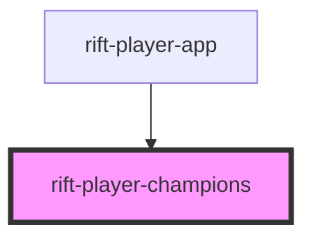

# rift-player-champions

<!-- Auto Generated Below -->

## Properties

| Property         | Attribute | Description                                                 | Type                    | Default     |
| ---------------- | --------- | ----------------------------------------------------------- | ----------------------- | ----------- |
| `ownedChampions` | --        | Owned champions. Falls back to mock data when not provided. | `PlayerChampionEntry[]` | `undefined` |

## Dependencies

### Used by

 - [rift-player-app](../rift-player-app)

### Graph

----------------------------------------------

*Built with [StencilJS](https://stenciljs.com/)*
