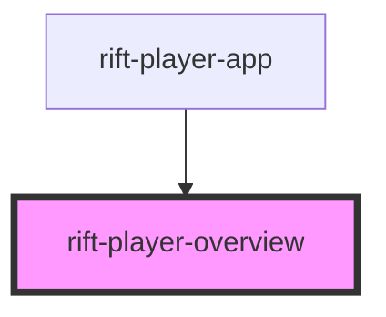

# rift-player-overview

<!-- Auto Generated Below -->

## Properties

| Property | Attribute | Description | Type            | Default     |
| -------- | --------- | ----------- | --------------- | ----------- |
| `user`   | --        |             | `PlayerSummary` | `undefined` |

## Dependencies

### Used by

 - [rift-player-app](../rift-player-app)

### Graph

----------------------------------------------

*Built with [StencilJS](https://stenciljs.com/)*
